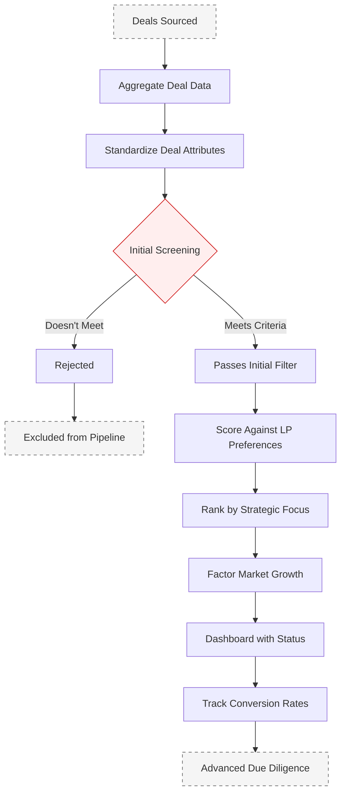

# Deal Pipeline Management

## Current State Challenges

Manual deal screening process with limited ability to evaluate opportunities against multiple LP criteria simultaneously, resulting in inefficient deal evaluation and potential missed opportunities.

## Enhanced State Capabilities

Advanced deal screening engine that scores opportunities against multiple LP profiles simultaneously, with intelligent algorithms that continuously improve match quality based on historical data and outcomes.

## Process Flow Diagram

## Strategic Implementation Framework

### 1. Deal Intake System

Automated deal capture and processing:

- **Standardized submission forms**: Digital intake forms with required fields and data validation
- **Document processing**: AI-powered extraction of key deal parameters from offering memorandums
- **Market data integration**: Automatic enrichment with market and submarket data
- **Historical comparison**: Pattern matching against historical deal database

### 2. Screening Algorithm

Multi-factor screening methodology:

- **Core criteria evaluation**: Automated checking against minimum investment criteria
- **Risk factor analysis**: Systematic evaluation of key risk indicators
- **Return metrics calculation**: Standardized computation of key performance metrics
- **Market alignment assessment**: Comparison with target market parameters

### 3. LP Profile Matching

Comprehensive matching system:

- **Multi-LP evaluation**: Simultaneous scoring against all active LP profiles
- **Preference weighting**: Dynamic weighting based on LP priority and capacity
- **Portfolio fit analysis**: Evaluation of portfolio diversification impact
- **Historical preference alignment**: Pattern matching with past investment decisions

### 4. Deal Scoring Engine

Advanced scoring methodology:

- **Composite score calculation**: Weighted evaluation across multiple dimensions
- **Risk-adjusted scoring**: Integration of risk factors into final scoring
- **Confidence metrics**: Statistical reliability measures for scoring components
- **Comparative analysis**: Benchmarking against historical deals

### 5. Process Automation

Workflow automation features:

- **Status tracking**: Automated deal stage progression
- **Task management**: Dynamic task creation and assignment
- **Communication automation**: Triggered notifications and updates
- **Document generation**: Automated creation of deal summaries and reports

## Implementation Considerations

- Begin with core screening criteria, expanding to advanced metrics in later phases
- Implement feedback loops for continuous algorithm refinement
- Ensure scalability for increasing deal volume
- Maintain audit trails for all automated decisions