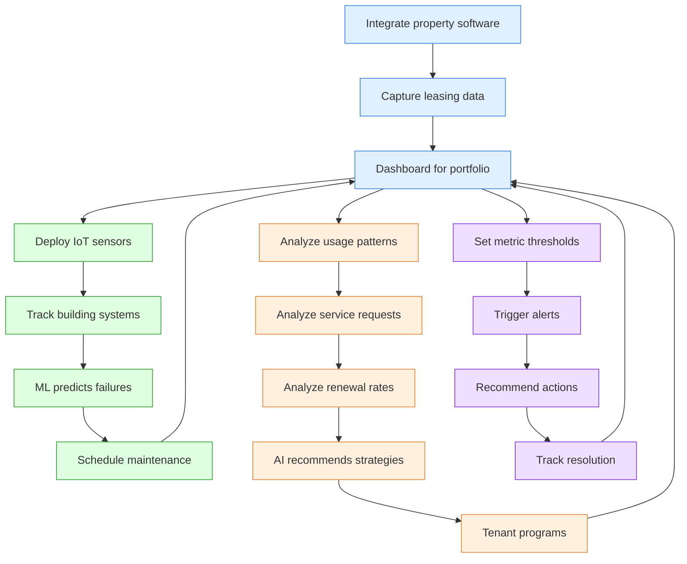

# AI-Powered Asset Management

## Overview

AI-powered asset management transforms how properties are managed, monitored, and optimized throughout their lifecycle. By leveraging IoT sensors, predictive analytics, and automated systems, organizations can anticipate maintenance issues, optimize tenant management, and maximize property performance.

## Current State Challenges

Manual property management processes with reactive maintenance, limited tenant data utilization, and inefficient service resolution, resulting in higher operational costs and reduced tenant satisfaction.

## Enhanced State Capabilities

Intelligent asset management platform integrating IoT sensors, predictive maintenance algorithms, tenant analytics, and automated alert systems to optimize property performance and tenant satisfaction.

## AI-Powered Asset Management Process

The following diagram illustrates the comprehensive approach to AI-powered asset management, highlighting the integration of property data, predictive maintenance, tenant analysis, and alert systems.

This diagram illustrates how AI transforms asset management through three integrated branches: predictive maintenance, tenant analysis, and alert systems. The central portfolio dashboard serves as the hub, receiving data from all systems and providing a unified view of property performance. IoT sensors monitor building systems to predict failures before they occur, while tenant data analysis reveals patterns that drive retention strategies. The alert system ensures timely responses to issues through automated threshold monitoring and action recommendations. All components continuously feed performance data back to the central dashboard, creating a self-improving system.

## Strategic Implementation Framework

### 1. Integrated Data Platform

Unified property data architecture:

- **Central repository**: Consolidated storage for all property-related data
- **IoT integration**: Connectivity with smart building sensors and devices
- **Tenant data collection**: Structured capture of tenant interactions and feedback
- **Market data incorporation**: Integration of external market indicators and benchmarks

### 2. Predictive Maintenance System

Proactive maintenance capabilities:

- **Component monitoring**: Real-time tracking of critical building systems
- **Failure prediction**: ML algorithms to anticipate maintenance needs
- **Maintenance scheduling**: Automated work order generation and tracking
- **Cost optimization**: Predictive budgeting based on maintenance forecasts

### 3. Tenant Relationship Management

Data-driven tenant engagement:

- **Tenant behavior analysis**: Pattern recognition in usage and requests
- **Satisfaction prediction**: Early identification of at-risk tenants
- **Personalized communications**: Tailored messaging based on tenant profiles
- **Renewal optimization**: Strategic engagement to maximize renewals

### 4. Performance Analytics

Comprehensive performance monitoring:

- **Real-time KPI tracking**: Live monitoring of key performance indicators
- **Benchmarking capability**: Comparison against internal and external standards
- **Anomaly detection**: Automated identification of performance outliers
- **Optimization recommendations**: AI-generated improvement suggestions

### 5. Alert Management System

Proactive issue resolution:

- **Threshold-based monitoring**: Customizable alert parameters
- **Priority determination**: Automated assessment of issue severity
- **Response automation**: Predefined action plans for common issues
- **Resolution tracking**: Comprehensive monitoring of issue resolution

## Implementation Considerations

- Begin with core data integration and centralized dashboard
- Prioritize IoT deployment based on system criticality and failure impact
- Implement tenant analytics in phases, starting with engagement metrics
- Ensure alert system configuration balances responsiveness with alert fatigue prevention