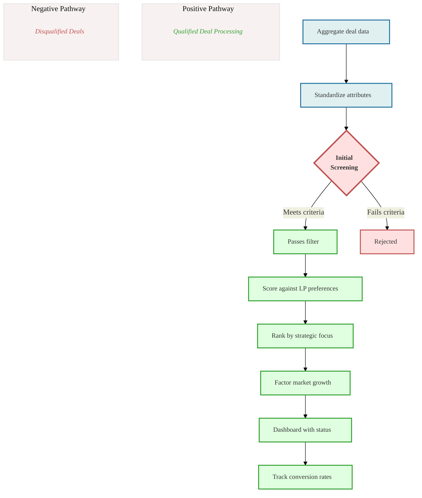

# Deal Pipeline Management

## Deal Pipeline Management Process

The following diagram illustrates the AI-enhanced deal pipeline management workflow, showing how deals are processed, evaluated, and tracked through the system.

This diagram shows the standardized process for deal evaluation and pipeline management. The system aggregates and standardizes deal data before applying an initial screening filter. Qualified deals then progress through multiple scoring and ranking steps that factor in LP preferences, strategic focus, and market conditions. The dashboard tracks conversion rates to continuously improve the screening criteria and matching algorithms.

## Current State Challenges

Manual deal screening process with limited ability to evaluate opportunities against multiple LP criteria simultaneously, resulting in inefficient deal evaluation and potential missed opportunities.

## Enhanced State Capabilities

Advanced deal screening engine that scores opportunities against multiple LP profiles simultaneously, with intelligent algorithms that continuously improve match quality based on historical data and outcomes.

  

    
Deals Sourced

    
↓

    
Aggregate Deal Data

    
↓

    
Standardize Deal Attributes

    
↓

    
Initial Screening

  

  
  

    

      <h5>Meets Criteria</h5>
      
Passes Initial Filter

      
↓

      
Score Against LP Preferences

      
↓

      
Rank by Strategic Focus

      
↓

      
Factor Market Growth

      
↓

      
Dashboard with Status

      
↓

      
Track Conversion Rates

      
↓

      
Advanced Due Diligence

    

    
    

      <h5>Doesn't Meet Criteria</h5>
      
Rejected

      
↓

      
Excluded from Pipeline

    

  

## Strategic Implementation Framework

### 1. Deal Intake System

Automated deal capture and processing:

- **Standardized submission forms**: Digital intake forms with required fields and data validation
- **Document processing**: AI-powered extraction of key deal parameters from offering memorandums
- **Market data integration**: Automatic enrichment with market and submarket data
- **Historical comparison**: Pattern matching against historical deal database

### 2. Screening Algorithm

Multi-factor screening methodology:

- **Core criteria evaluation**: Automated checking against minimum investment criteria
- **Risk factor analysis**: Systematic evaluation of key risk indicators
- **Return metrics calculation**: Standardized computation of key performance metrics
- **Market alignment assessment**: Comparison with target market parameters

### 3. LP Profile Matching

Comprehensive matching system:

- **Multi-LP evaluation**: Simultaneous scoring against all active LP profiles
- **Preference weighting**: Dynamic weighting based on LP priority and capacity
- **Portfolio fit analysis**: Evaluation of portfolio diversification impact
- **Historical preference alignment**: Pattern matching with past investment decisions

### 4. Deal Scoring Engine

Advanced scoring methodology:

- **Composite score calculation**: Weighted evaluation across multiple dimensions
- **Risk-adjusted scoring**: Integration of risk factors into final scoring
- **Confidence metrics**: Statistical reliability measures for scoring components
- **Comparative analysis**: Benchmarking against historical deals

### 5. Process Automation

Workflow automation features:

- **Status tracking**: Automated deal stage progression
- **Task management**: Dynamic task creation and assignment
- **Communication automation**: Triggered notifications and updates
- **Document generation**: Automated creation of deal summaries and reports

## Implementation Considerations

- Begin with core screening criteria, expanding to advanced metrics in later phases
- Implement feedback loops for continuous algorithm refinement
- Ensure scalability for increasing deal volume
- Maintain audit trails for all automated decisions