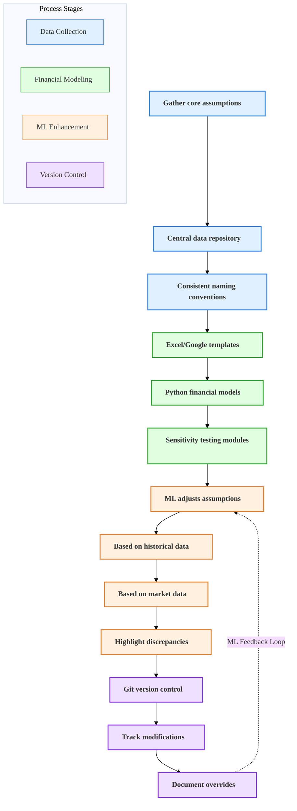

# Financial Modeling

## Current State Challenges

Manual financial modeling processes with inconsistent templates and limited scenario analysis capabilities, leading to time-consuming analysis and potential for errors.

## Enhanced State Capabilities

Advanced system with standardized templates, scenario analysis capabilities, and sensitivity testing algorithms for improved investment decision-making.

## AI-Enhanced Financial Modeling Process

The following diagram illustrates how AI and machine learning enhance the financial modeling process, providing more accurate projections and continuous improvement.

This diagram shows the complete financial modeling process enhanced by AI. Starting with standardized data collection and storage, the workflow progresses through model development and then leverages machine learning to refine assumptions based on historical and market data. The integrated feedback loop continuously improves model accuracy over time, while version control ensures all changes are tracked and documented.

## Process Flow Diagram

<table class="financial-model-table">
  <tr>
    <th class="phase-header phase1">Assumptions</th>
    <th class="phase-header phase2">Model Development</th>
    <th class="phase-header phase3">ML Enhancement</th>
    <th class="phase-header phase4">Documentation</th>
  </tr>
  <tr>
    <td class="phase-cell phase1">Gather Assumptions</td>
    <td class="phase-cell phase2">Create Model Templates</td>
    <td class="phase-cell phase3">ML Adjusts Assumptions</td>
    <td class="phase-cell phase4">Version Control</td>
  </tr>
  <tr>
    <td class="phase-cell phase1">Store in Repository</td>
    <td class="phase-cell phase2">Build Python Models</td>
    <td class="phase-cell phase3">Analyze Historical Data</td>
    <td class="phase-cell phase4">Track All Changes</td>
  </tr>
  <tr>
    <td class="phase-cell phase1">Standardize Naming</td>
    <td class="phase-cell phase2">Add Sensitivity Testing</td>
    <td class="phase-cell phase3">Incorporate Market Data</td>
    <td class="phase-cell phase4">Document Overrides</td>
  </tr>
  <tr>
    <td class="phase-cell"></td>
    <td class="phase-cell"></td>
    <td class="phase-cell phase3">Highlight Discrepancies</td>
    <td class="phase-cell"></td>
  </tr>
</table>

  Financial Modeling Process - From Data Collection to Documentation

## Strategic Implementation Framework

### 1. Model Architecture

Standardized modeling framework:

- **Template library**: Comprehensive set of pre-built, validated models
- **Component modularity**: Reusable calculation modules
- **Version control**: Automated tracking of model versions and changes
- **Audit trails**: Detailed logging of all model modifications

### 2. Analysis Engine

Advanced analytical capabilities:

- **Scenario generation**: Automated creation of multiple scenarios
- **Sensitivity analysis**: Multi-variable sensitivity testing
- **Monte Carlo simulation**: Probability-based outcome modeling
- **Optimization algorithms**: Return optimization under constraints

### 3. Risk Modeling

Comprehensive risk assessment:

- **Risk factor identification**: Automated detection of key risk factors
- **Correlation analysis**: Inter-dependency modeling between variables
- **Stress testing**: Automated stress scenario generation
- **Risk metrics**: Standardized risk measurement framework

### 4. Reporting System

Automated reporting capabilities:

- **Dynamic dashboards**: Real-time model visualization
- **Custom reports**: Configurable reporting templates
- **Comparative analysis**: Side-by-side scenario comparison
- **Export capabilities**: Multi-format export options

### 5. Integration Framework

Seamless system integration:

- **Data source integration**: Automated data import from multiple sources
- **API connectivity**: Real-time data exchange capabilities
- **Output distribution**: Automated distribution to stakeholders
- **Workflow integration**: Connection to approval processes

## Implementation Considerations

- Begin with core templates and expand based on usage patterns
- Implement robust validation checks and error handling
- Ensure scalability for complex modeling requirements
- Maintain audit trails for regulatory compliance