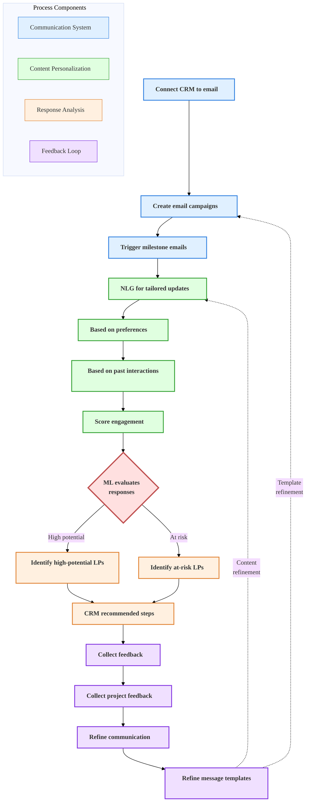

# Investor Relationship Management

## Current State Challenges

Manual investor communication processes with limited personalization and tracking capabilities, resulting in inconsistent engagement and missed relationship-building opportunities.

## Enhanced State Capabilities

Advanced communication system with automated triggers, personalized content generation, and engagement scoring to optimize LP relationships.

## Investor Relationship Management Process

The following diagram illustrates the integrated approach to investor relationship management, with AI-powered personalization and continuous improvement.

This comprehensive workflow demonstrates how AI enhances investor relationship management. Starting with a connected CRM system, the process leverages natural language generation to create personalized communications based on investor preferences and past interactions. Machine learning analyzes responses to identify both high-potential and at-risk LPs, recommending appropriate follow-up actions. The entire system continuously improves through feedback loops that refine both templates and content generation algorithms.

## Process Flow Diagram

  

    <h4>Setup Phase</h4>
    <ul class="step-list">
      <li class="process-step">Connect CRM to Email</li>
      <li class="process-step">Set Up Campaigns</li>
      <li class="process-step">Configure Triggers</li>
    </ul>
  

  
  
↓

  
  

    <h4>Content Phase</h4>
    <ul class="step-list">
      <li class="process-step">Deploy Content Engine</li>
      <li class="process-step">Apply LP Preferences</li>
      <li class="process-step">Analyze Past Interactions</li>
      <li class="process-step">Score Engagement</li>
    </ul>
  

  
  
↓

  
  

    <h4>Analysis Phase</h4>
    <ul class="step-list">
      <li class="process-step">Evaluate Response Patterns</li>
      <li class="dual-steps">
        Identify Priority LPs
        Identify At-Risk LPs
      </li>
      <li class="process-step">Suggest Next Actions</li>
    </ul>
  

  
  
↓

  
  

    <h4>Feedback Phase</h4>
    <ul class="step-list">
      <li class="process-step">Gather Feedback</li>
      <li class="process-step">Record Project Feedback</li>
      <li class="process-step">Refine Communications</li>
      <li class="process-step">Update Templates</li>
    </ul>
  

  
  
⟲ Continuous Improvement Loop: Feedback drives refinements to campaigns and content

## Strategic Implementation Framework

### 1. Communication Engine

Automated communication system:

- **Content personalization**: AI-driven content customization
- **Multi-channel delivery**: Coordinated messaging across platforms
- **Timing optimization**: Data-driven scheduling
- **Response tracking**: Automated engagement monitoring

### 2. Engagement Analytics

Comprehensive tracking system:

- **Interaction scoring**: Weighted evaluation of engagement
- **Sentiment analysis**: NLP-based communication analysis
- **Relationship health**: Automated relationship scoring
- **Trend detection**: Pattern recognition in engagement

### 3. Profile Enhancement

Dynamic profile management:

- **Preference learning**: Automated preference detection
- **Interest tracking**: Real-time interest monitoring
- **Communication history**: Comprehensive interaction logging
- **Relationship mapping**: Network analysis and visualization

### 4. Reporting Dashboard

Interactive reporting system:

- **Real-time metrics**: Live engagement tracking
- **Performance analytics**: ROI measurement
- **Relationship insights**: AI-generated recommendations
- **Custom reporting**: Configurable report generation

### 5. Process Automation

Workflow optimization:

- **Task automation**: Automated follow-up scheduling
- **Alert system**: Proactive notification system
- **Document generation**: Automated content creation
- **Integration framework**: CRM system connectivity

## Implementation Considerations

- Begin with core communication workflows
- Implement progressive personalization
- Ensure compliance with privacy regulations
- Maintain relationship authenticity