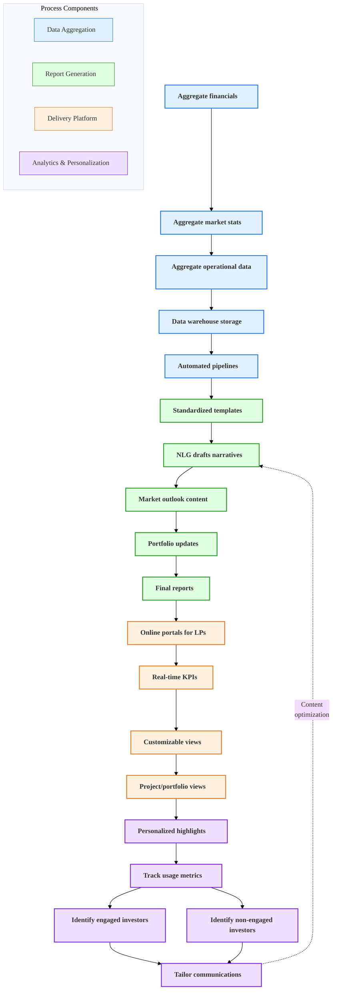

# AI-Enhanced Investor Reporting

## Overview

AI-enhanced investor reporting transforms how investment performance and portfolio updates are delivered to limited partners. By leveraging automated data aggregation, natural language generation, and personalized content delivery, organizations can provide more frequent, detailed, and insightful reporting while reducing manual effort.

## Current State Challenges

Manual reporting processes with inconsistent formatting, time-consuming data collection, and limited personalization, resulting in reporting delays and missed opportunities for strategic investor communication.

## Enhanced State Capabilities

Advanced reporting platform with automated data aggregation, AI-generated narrative content, and personalized delivery to provide timely, relevant, and actionable insights to investors.

## AI-Enhanced Investor Reporting Process

The following diagram illustrates the comprehensive workflow for AI-enhanced investor reporting, showing how data is transformed into personalized investor communications.

This diagram illustrates the end-to-end process for AI-enhanced investor reporting. It begins with comprehensive data aggregation from financial, market, and operational sources into a centralized data warehouse with automated processing pipelines. The report generation phase leverages natural language generation (NLG) to create narrative content and standardized reports. These are delivered through interactive online portals that provide real-time KPIs and customizable views. The final phase analyzes investor engagement with reports to identify both highly engaged and disengaged investors, allowing for tailored communications. A continuous feedback loop optimizes content generation based on engagement metrics, ensuring reports become increasingly relevant to each investor's interests.

## Strategic Implementation Framework

### 1. Data Integration System

Comprehensive data collection:

- **Financial data pipeline**: Automated extraction from accounting systems
- **Market data integration**: Real-time market indicator incorporation
- **Operational metrics**: Performance data from property management systems
- **Standardization protocols**: Consistent data formatting and normalization

### 2. Content Generation Engine

Automated report creation:

- **Template library**: Standardized reporting templates by asset class and report type
- **Narrative generation**: NLG algorithms for performance descriptions and analysis
- **Market commentary**: AI-generated market context and outlook
- **Dynamic formatting**: Automated layout optimization for different delivery channels

### 3. Delivery Platform

Multi-channel distribution:

- **Investor portal**: Secure online access to reports and dashboards
- **Interactive dashboards**: Self-service exploration and visualization tools
- **Mobile integration**: Responsive design for mobile device access
- **Export capabilities**: Multiple download formats for offline review

### 4. Personalization System

Tailored experience:

- **Preference tracking**: Monitoring of investor engagement and interests
- **Content customization**: Tailored highlights based on investor profiles
- **Communication preferences**: Delivery channel and frequency optimization
- **Language adaptation**: Tone and terminology customization by investor

### 5. Engagement Analytics

Interaction measurement:

- **Usage tracking**: Measurement of report interaction and engagement
- **Effectiveness metrics**: KPIs for report impact and utility
- **Investor segmentation**: Grouping by engagement patterns
- **Continuous optimization**: Testing and refinement of content and format

## Implementation Considerations

- Begin with core financial data integration and standardized templates
- Implement personalization in phases as investor preference data accumulates
- Ensure compliance with regulatory reporting requirements
- Provide traditional report access alongside new digital platforms during transition