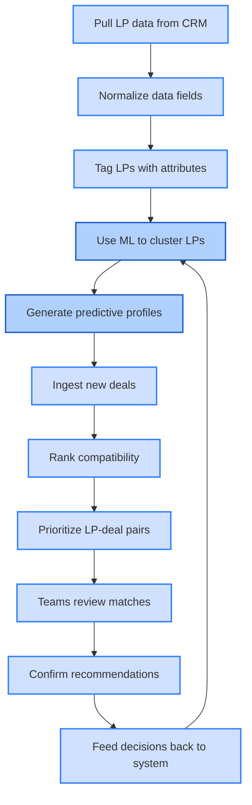
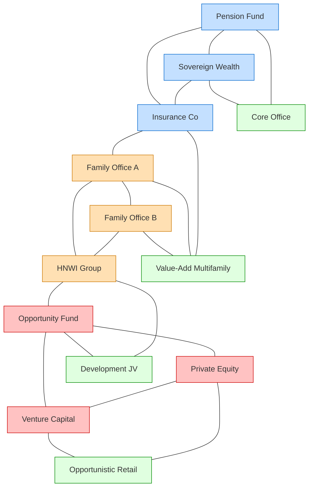

# LP Identification & Matching

## Current State Challenges

Manual profiling and CRM tracking of 10-20 targeted LPs with inconsistent data capture and limited ability to match LPs with appropriate deals.

## Enhanced State Capabilities

An intelligent matching system creating detailed LP profiles, scoring their preferences, and automatically matching them with suitable investment opportunities using sophisticated predictive algorithms.

## LP Identification and Matching Flow

The following diagram illustrates the intelligent workflow for identifying and matching limited partners with investment opportunities, emphasizing how machine learning enhances the process.

This system integrates CRM data with machine learning to create an intelligent matching process. The highlighted ML components continuously improve through feedback loops, learning from successful matches to refine future recommendations.

## LP Classification Analysis

The following diagram demonstrates how LPs can be clustered by investment preferences, revealing natural groupings and affinities between investor types and deal categories.

This clustering visualization shows how different types of investors naturally gravitate toward specific deal types. Institutional investors (blue) prefer stable core office properties, family offices (orange) favor value-add multifamily, while opportunity investors (red) target higher-risk development JVs and opportunistic retail. This analysis enables more targeted matching and outreach strategies.

## Process Flow Diagram

  
LP Matching Process START

  
↓

  
Collect LP Data

  
↓

  
Create LP Profile

  
↓

  
Enrich Profile with Historical Data

  
↓

  
Generate Preference Score Matrix

  
↓

  
Collect Deal Data

  
↓

  
Create Deal Profile

  
↓

  
Run Matching Algorithm

  
↓

  
Rank LP-Deal Matches by Score

  
↓

  
Display Top Matches with Rationale

  
↓

  
Match Score > Threshold?

  

    

      
Yes ↓

      
Notify Investment Team

      
↓

      
Present to LP

      
↓

      
LP Interested?

      

        

          
Yes ↓

          
Initiate Deal Process

          
↓

          
PROCESS END

        

        

          
No ↓

          
Capture Feedback

          
↓

          
Adjust LP Preferences

          
↓

          
Refine Algorithm

          
↓

          
PROCESS END

        

      

    

    

      
No ↓

      
Store for Later Review

      
↓

      
Refine Algorithm

      
↓

      
PROCESS END

    

  

## Strategic Implementation Framework

### 1. Investor Data Architecture

Development of custom LP profile schema with:

- **Geographic preference mapping matrix**: Detailed scoring of LP interest by market, submarket, and neighborhood
- **Asset class preference hierarchy**: Weighted ranking of multifamily, office, retail, industrial, and specialty sectors
- **Investment parameter classification**: Structured categorization of return requirements, hold periods, and exit strategies
- **Return expectation alignment indexes**: Standardized metrics for comparing LP expectations with deal projections
- **Risk tolerance profiling**: Quantified assessment of LP appetite for various risk factors

### 2. Profile Enrichment Protocol

Implementation of multi-source enrichment methodology:

- **Transaction history integration**: Automated analysis of past investment patterns and preferences
- **Communication sentiment analysis**: NLP processing of email and meeting records to identify unstated preferences
- **Public record enhancement**: Integration of publicly available information about LP investment activities
- **Investment trend pattern recognition**: Algorithm to identify emerging preference patterns based on recent decisions

### 3. Preference Scoring Matrix

Application of weighted scoring system that balances:

- **Stated preferences**: Explicit factors directly communicated by LPs
- **Historical behavior**: Implicit signals derived from past investment decisions
- **Current portfolio composition**: Contextual elements based on existing holdings and diversification needs

### 4. Intelligent Matching Engine

Deployment of algorithmic matching system:

- **Multi-variable scoring**: Comprehensive assessment against all LP profiles simultaneously
- **Dynamic ranking with confidence intervals**: Statistical reliability measures for each match
- **Visual representation of match factors**: Interactive display of key match criteria and strength indicators

### 5. Continuous Learning System

Implementation of adaptive feedback methodology:

- **Response pattern analysis**: Tracking of LP reactions to presented opportunities
- **Preference evolution tracking**: Detection of shifting LP priorities over time
- **Algorithm refinement protocols**: Systematic improvement based on match outcomes

## Implementation Considerations

- Begin with core profiling fields, expanding with advanced fields in phase two
- Implement validation cycle approach during the first quarter
- Deploy dual-metric scoring: quantitative and qualitative assessment
- Utilize progressive disclosure methodology for continuous preference refinement