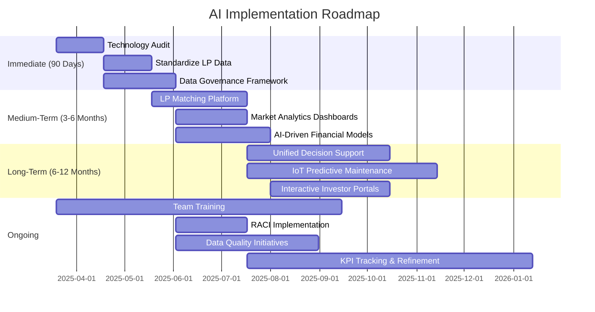

# Implementation Timeline

This page outlines DISRVPT VENTURES' phased approach to implementing the AI transformation initiatives for LG GROUP.

## AI Implementation Roadmap Timeline

The following Gantt chart provides a detailed timeline for the AI implementation roadmap, showing key tasks, dependencies, and milestones across the three implementation phases.

This Gantt chart illustrates the phased implementation approach for the AI transformation initiatives. The timeline is divided into immediate (90-day), medium-term (3-6 month), and long-term (6-12 month) phases, with clear dependencies between tasks. Ongoing activities span multiple phases to ensure continuous improvement and adoption. Key milestones mark the completion of each phase, providing clear checkpoints for progress evaluation.

## Implementation Roadmap

  <h3 class="gantt-title">LG Development AI Implementation Timeline</h3>
  
  

    
Immediate (90 Days)

    

      

        
Technology Assessment

        
Mar 19 - Apr 18, 2025

      

      

        
Data Strategy Development

        
Apr 19 - May 19, 2025

      

      

        
Rapid Value Implementation

        
May 20 - Jun 19, 2025

      

    

  

  
  

    
Medium-Term (3-6 Months)

    

      

        
LP Matching Platform

        
Jun 20 - Aug 19, 2025

      

      

        
Market Intelligence System

        
Jun 20 - Aug 4, 2025

      

      

        
Enhanced Communications

        
Aug 5 - Sep 19, 2025

      

    

  

  
  

    
Long-Term (6-12 Months)

    

      

        
Decision Support System

        
Aug 20 - Nov 18, 2025

      

      

        
Asset Management Platform

        
Aug 5 - Oct 4, 2025

      

      

        
AI-Enhanced Project Tools

        
Oct 5 - Dec 4, 2025

      

    

  

## Implementation Phases

<table class="timeline-table">
  <tr>
    <th class="phase-header phase1">Immediate Phase (90 Days)</th>
    <th class="phase-header phase2">Medium-Term Phase (3-6 Months)</th>
    <th class="phase-header phase3">Long-Term Phase (6-12 Months)</th>
  </tr>
  <tr>
    <td class="phase-period">March - May 2025</td>
    <td class="phase-period">June - August 2025</td>
    <td class="phase-period">September 2025 - February 2026</td>
  </tr>
  <tr>
    <td class="phase-content">
      

        <h4>1. Technology Assessment</h4>
        <ul>
          <li>Inventory existing systems and data sources</li>
          <li>Evaluate integration capabilities</li>
          <li>Design system architecture blueprint</li>
          <li>Select technology stack components</li>
          <li>Establish data governance framework</li>
        </ul>
      

    </td>
    <td class="phase-content">
      

        <h4>1. LP Matching Platform</h4>
        <ul>
          <li>Deploy LP profile management system</li>
          <li>Implement matching algorithm</li>
          <li>Create automated scoring system</li>
          <li>Build preference learning engine</li>
        </ul>
      

    </td>
    <td class="phase-content">
      

        <h4>1. Decision Support System</h4>
        <ul>
          <li>Implement AI-driven decision models</li>
          <li>Create scenario analysis engine</li>
          <li>Deploy optimization algorithms</li>
          <li>Build recommendation system</li>
        </ul>
      

    </td>
  </tr>
  <tr>
    <td class="phase-content">
      

        <h4>2. Data Strategy Development</h4>
        <ul>
          <li>Create standardized data models</li>
          <li>Establish collection protocols</li>
          <li>Develop quality control standards</li>
          <li>Define integration methodology</li>
          <li>Create consistent terminology dictionary</li>
        </ul>
      

    </td>
    <td class="phase-content">
      

        <h4>2. Market Intelligence System</h4>
        <ul>
          <li>Set up data integration pipelines</li>
          <li>Deploy predictive analytics models</li>
          <li>Create market monitoring dashboards</li>
          <li>Implement alert system</li>
        </ul>
      

    </td>
    <td class="phase-content">
      

        <h4>2. Asset Management Platform</h4>
        <ul>
          <li>Deploy performance monitoring system</li>
          <li>Implement predictive maintenance</li>
          <li>Create optimization engine</li>
          <li>Build reporting dashboard</li>
        </ul>
      

    </td>
  </tr>
  <tr>
    <td class="phase-content">
      

        <h4>3. Rapid Value Implementation</h4>
        <ul>
          <li>Configure investor database foundation</li>
          <li>Build deal intake framework</li>
          <li>Create core financial model templates</li>
          <li>Establish basic investor dashboard</li>
          <li>Implement initial communication workflows</li>
        </ul>
      

    </td>
    <td class="phase-content">
      

        <h4>3. Enhanced Communications</h4>
        <ul>
          <li>Deploy automated communication system</li>
          <li>Implement personalization engine</li>
          <li>Create engagement tracking</li>
          <li>Build reporting templates</li>
        </ul>
      

    </td>
    <td class="phase-content">
      

        <h4>3. AI-Enhanced Project Tools</h4>
        <ul>
          <li>Deploy project management AI</li>
          <li>Implement resource optimization</li>
          <li>Create automated workflows</li>
          <li>Build progress tracking system</li>
        </ul>
      

    </td>
  </tr>
</table>

