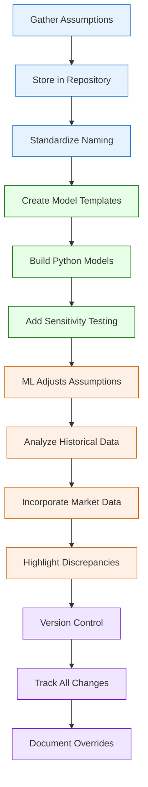

# Financial Modeling

## Current State Challenges

Manual financial modeling processes with inconsistent templates and limited scenario analysis capabilities, leading to time-consuming analysis and potential for errors.

## Enhanced State Capabilities

Advanced system with standardized templates, scenario analysis capabilities, and sensitivity testing algorithms for improved investment decision-making.

## Process Flow Diagram

## Strategic Implementation Framework

### 1. Model Architecture

Standardized modeling framework:

- **Template library**: Comprehensive set of pre-built, validated models
- **Component modularity**: Reusable calculation modules
- **Version control**: Automated tracking of model versions and changes
- **Audit trails**: Detailed logging of all model modifications

### 2. Analysis Engine

Advanced analytical capabilities:

- **Scenario generation**: Automated creation of multiple scenarios
- **Sensitivity analysis**: Multi-variable sensitivity testing
- **Monte Carlo simulation**: Probability-based outcome modeling
- **Optimization algorithms**: Return optimization under constraints

### 3. Risk Modeling

Comprehensive risk assessment:

- **Risk factor identification**: Automated detection of key risk factors
- **Correlation analysis**: Inter-dependency modeling between variables
- **Stress testing**: Automated stress scenario generation
- **Risk metrics**: Standardized risk measurement framework

### 4. Reporting System

Automated reporting capabilities:

- **Dynamic dashboards**: Real-time model visualization
- **Custom reports**: Configurable reporting templates
- **Comparative analysis**: Side-by-side scenario comparison
- **Export capabilities**: Multi-format export options

### 5. Integration Framework

Seamless system integration:

- **Data source integration**: Automated data import from multiple sources
- **API connectivity**: Real-time data exchange capabilities
- **Output distribution**: Automated distribution to stakeholders
- **Workflow integration**: Connection to approval processes

## Implementation Considerations

- Begin with core templates and expand based on usage patterns
- Implement robust validation checks and error handling
- Ensure scalability for complex modeling requirements
- Maintain audit trails for regulatory compliance