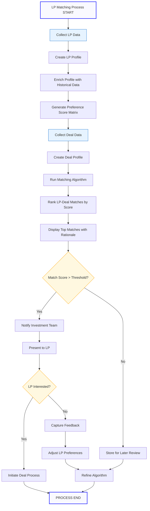

# LP Identification & Matching

## Current State Challenges

Manual profiling and CRM tracking of 10-20 targeted LPs with inconsistent data capture and limited ability to match LPs with appropriate deals.

## Enhanced State Capabilities

An intelligent matching system creating detailed LP profiles, scoring their preferences, and automatically matching them with suitable investment opportunities using sophisticated predictive algorithms.

## Process Flow Diagram

## Strategic Implementation Framework

### 1. Investor Data Architecture

Development of custom LP profile schema with:

- **Geographic preference mapping matrix**: Detailed scoring of LP interest by market, submarket, and neighborhood
- **Asset class preference hierarchy**: Weighted ranking of multifamily, office, retail, industrial, and specialty sectors
- **Investment parameter classification**: Structured categorization of return requirements, hold periods, and exit strategies
- **Return expectation alignment indexes**: Standardized metrics for comparing LP expectations with deal projections
- **Risk tolerance profiling**: Quantified assessment of LP appetite for various risk factors

### 2. Profile Enrichment Protocol

Implementation of multi-source enrichment methodology:

- **Transaction history integration**: Automated analysis of past investment patterns and preferences
- **Communication sentiment analysis**: NLP processing of email and meeting records to identify unstated preferences
- **Public record enhancement**: Integration of publicly available information about LP investment activities
- **Investment trend pattern recognition**: Algorithm to identify emerging preference patterns based on recent decisions

### 3. Preference Scoring Matrix

Application of weighted scoring system that balances:

- **Stated preferences**: Explicit factors directly communicated by LPs
- **Historical behavior**: Implicit signals derived from past investment decisions
- **Current portfolio composition**: Contextual elements based on existing holdings and diversification needs

### 4. Intelligent Matching Engine

Deployment of algorithmic matching system:

- **Multi-variable scoring**: Comprehensive assessment against all LP profiles simultaneously
- **Dynamic ranking with confidence intervals**: Statistical reliability measures for each match
- **Visual representation of match factors**: Interactive display of key match criteria and strength indicators

### 5. Continuous Learning System

Implementation of adaptive feedback methodology:

- **Response pattern analysis**: Tracking of LP reactions to presented opportunities
- **Preference evolution tracking**: Detection of shifting LP priorities over time
- **Algorithm refinement protocols**: Systematic improvement based on match outcomes

## Implementation Considerations

- Begin with core profiling fields, expanding with advanced fields in phase two
- Implement validation cycle approach during the first quarter
- Deploy dual-metric scoring: quantitative and qualitative assessment
- Utilize progressive disclosure methodology for continuous preference refinement