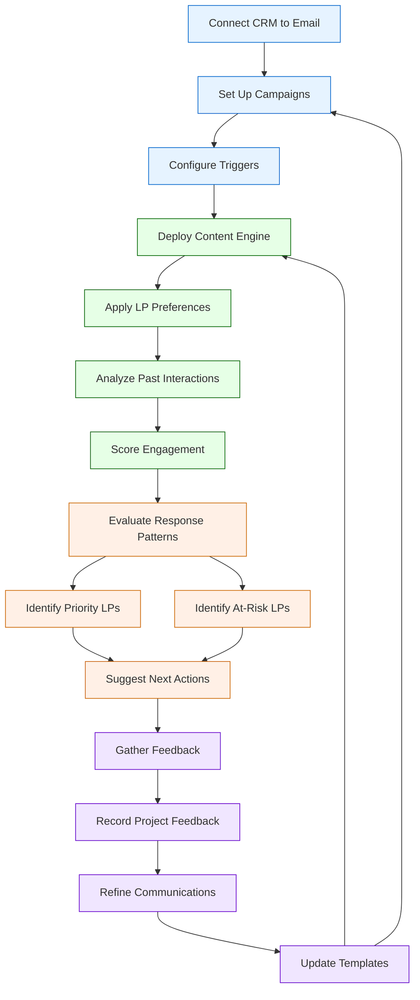

# Investor Relationship Management

## Current State Challenges

Manual investor communication processes with limited personalization and tracking capabilities, resulting in inconsistent engagement and missed relationship-building opportunities.

## Enhanced State Capabilities

Advanced communication system with automated triggers, personalized content generation, and engagement scoring to optimize LP relationships.

## Process Flow Diagram

## Strategic Implementation Framework

### 1. Communication Engine

Automated communication system:

- **Content personalization**: AI-driven content customization
- **Multi-channel delivery**: Coordinated messaging across platforms
- **Timing optimization**: Data-driven scheduling
- **Response tracking**: Automated engagement monitoring

### 2. Engagement Analytics

Comprehensive tracking system:

- **Interaction scoring**: Weighted evaluation of engagement
- **Sentiment analysis**: NLP-based communication analysis
- **Relationship health**: Automated relationship scoring
- **Trend detection**: Pattern recognition in engagement

### 3. Profile Enhancement

Dynamic profile management:

- **Preference learning**: Automated preference detection
- **Interest tracking**: Real-time interest monitoring
- **Communication history**: Comprehensive interaction logging
- **Relationship mapping**: Network analysis and visualization

### 4. Reporting Dashboard

Interactive reporting system:

- **Real-time metrics**: Live engagement tracking
- **Performance analytics**: ROI measurement
- **Relationship insights**: AI-generated recommendations
- **Custom reporting**: Configurable report generation

### 5. Process Automation

Workflow optimization:

- **Task automation**: Automated follow-up scheduling
- **Alert system**: Proactive notification system
- **Document generation**: Automated content creation
- **Integration framework**: CRM system connectivity

## Implementation Considerations

- Begin with core communication workflows
- Implement progressive personalization
- Ensure compliance with privacy regulations
- Maintain relationship authenticity