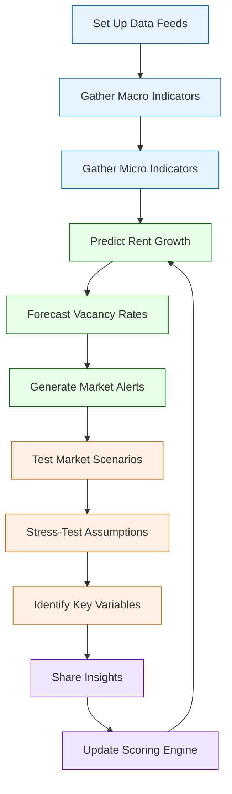

# Market Analysis

## Current State Challenges

Manual market research process with fragmented data sources and limited ability to identify emerging trends or opportunities in real-time.

## Enhanced State Capabilities

Predictive analytics system to forecast market performance in target geographies with automated monitoring of key indicators and custom alert thresholds.

## Process Flow Diagram

## Strategic Implementation Framework

### 1. Data Integration System

Comprehensive data collection and processing:

- **Multiple source integration**: Automated collection from various market data providers
- **Real-time data feeds**: Live integration of market indicators and trends
- **Alternative data sources**: Integration of non-traditional data signals
- **Data quality control**: Automated validation and cleaning processes

### 2. Market Intelligence Engine

Advanced analytics capabilities:

- **Predictive modeling**: Machine learning models for market performance forecasting
- **Trend detection**: Pattern recognition for emerging market opportunities
- **Comparative analysis**: Cross-market performance evaluation
- **Scenario modeling**: Impact analysis of various market conditions

### 3. Risk Analytics

Sophisticated risk assessment framework:

- **Risk factor identification**: Automated detection of potential risk factors
- **Impact quantification**: Statistical modeling of risk impacts
- **Mitigation strategies**: AI-powered recommendation engine
- **Early warning system**: Proactive risk indicator monitoring

### 4. Opportunity Detection

Intelligent opportunity identification:

- **Market gap analysis**: Automated identification of market opportunities
- **Timing optimization**: Predictive modeling for market entry/exit
- **Competitive analysis**: Automated competitor tracking and analysis
- **Value-add potential**: AI-driven improvement opportunity detection

### 5. Reporting System

Comprehensive reporting capabilities:

- **Dynamic dashboards**: Real-time market performance visualization
- **Custom alerts**: Configurable notification system
- **Automated reports**: Scheduled market analysis generation
- **Interactive analytics**: Self-service analysis tools

## Implementation Considerations

- Phase implementation of data sources based on priority and reliability
- Ensure data privacy and security compliance
- Implement robust data validation protocols
- Maintain flexibility for adding new data sources and analytics capabilities