# Key Success Metrics

This page outlines the key performance indicators we'll use to measure the success of DISRVPT VENTURES' AI transformation initiatives for LG GROUP.

## Success Metrics Overview

```mermaid
graph TD
    SM[Success Metrics] --> EM[Efficiency Metrics]
    SM --> QM[Quality Metrics]
    SM --> BM[Business Impact Metrics]
    
    EM --> E1[50% reduction in LP-deal matching time]
    EM --> E2[75% reduction in financial modeling time]
    EM --> E3[40% faster market analysis]
    EM --> E4[60% reduction in reporting time]
    
    QM --> Q1[30% improvement in LP satisfaction]
    QM --> Q2[25% increase in deal qualification accuracy]
    QM --> Q3[20% better market trend predictions]
    QM --> Q4[35% reduction in reporting errors]
    
    BM --> B1[40% increase in qualified deals reviewed]
    BM --> B2[25% improvement in LP conversion rate]
    BM --> B3[15% enhancement in asset performance]
    BM --> B4[30% growth in LP network size]
    
    style SM fill:#f5f5f5,stroke:#333,stroke-width:2px
    style EM fill:#e6f3ff,stroke:#0066cc,stroke-width:2px
    style QM fill:#e6ffe6,stroke:#006600,stroke-width:2px
    style BM fill:#fff8e0,stroke:#cc9900,stroke-width:2px
    
    style E1 fill:#e6f3ff,stroke:#0066cc
    style E2 fill:#e6f3ff,stroke:#0066cc
    style E3 fill:#e6f3ff,stroke:#0066cc
    style E4 fill:#e6f3ff,stroke:#0066cc
    
    style Q1 fill:#e6ffe6,stroke:#006600
    style Q2 fill:#e6ffe6,stroke:#006600
    style Q3 fill:#e6ffe6,stroke:#006600
    style Q4 fill:#e6ffe6,stroke:#006600
    
    style B1 fill:#fff8e0,stroke:#cc9900
    style B2 fill:#fff8e0,stroke:#cc9900
    style B3 fill:#fff8e0,stroke:#cc9900
    style B4 fill:#fff8e0,stroke:#cc9900
```

## Efficiency Metrics

  <MetricCard 
    title="LP-Deal Matching Time" 
    value="50%" 
    description="Reduction in time spent on LP-deal matching process"
    type="efficiency"
  />
  <MetricCard 
    title="Financial Modeling Time" 
    value="75%" 
    description="Reduction in financial modeling and analysis time"
    type="efficiency"
  />
  <MetricCard 
    title="Market Analysis Speed" 
    value="40%" 
    description="Faster market analysis process through automation"
    type="efficiency"
  />
  <MetricCard 
    title="Reporting Time" 
    value="60%" 
    description="Reduction in reporting preparation time"
    type="efficiency"
  />

## Quality Metrics

  <MetricCard 
    title="LP Satisfaction" 
    value="30%" 
    description="Improvement in LP satisfaction scores"
    type="quality"
  />
  <MetricCard 
    title="Deal Qualification Accuracy" 
    value="25%" 
    description="Increase in deal qualification accuracy"
    type="quality"
  />
  <MetricCard 
    title="Market Trend Predictions" 
    value="20%" 
    description="Better predictive accuracy for market trends"
    type="quality"
  />
  <MetricCard 
    title="Reporting Errors" 
    value="35%" 
    description="Reduction in reporting errors through automation"
    type="quality"
  />

## Business Impact Metrics

  <MetricCard 
    title="Qualified Deals Reviewed" 
    value="40%" 
    description="Increase in qualified deals reviewed per month"
    type="business"
  />
  <MetricCard 
    title="LP Conversion Rate" 
    value="25%" 
    description="Improvement in LP conversion rate"
    type="business"
  />
  <MetricCard 
    title="Asset Performance" 
    value="15%" 
    description="Enhancement in asset performance via optimizations"
    type="business"
  />
  <MetricCard 
    title="LP Network Growth" 
    value="30%" 
    description="Growth in LP network size"
    type="business"
  />

