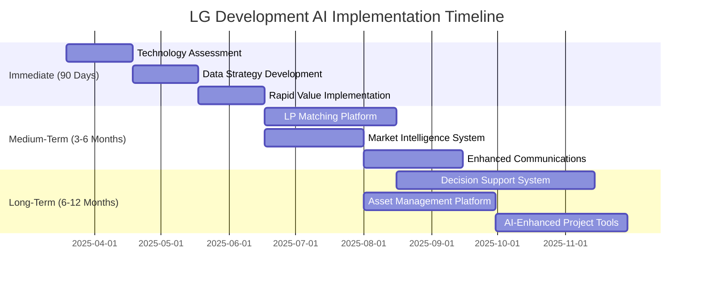

# Implementation Timeline

This page outlines DISRVPT VENTURES' phased approach to implementing the AI transformation initiatives for LG GROUP.

## Implementation Roadmap

## Immediate Phase (90 Days)

  

    <h3>Immediate Implementation</h3>
    
March - May 2025

  

  
  

    <h4>1. Technology Assessment & Architecture Design</h4>
    <ul>
      <li>Inventory existing systems and data sources</li>
      <li>Evaluate integration capabilities</li>
      <li>Design system architecture blueprint</li>
      <li>Select technology stack components</li>
      <li>Establish data governance framework</li>
    </ul>
    
    <h4>2. Data Strategy Development</h4>
    <ul>
      <li>Create standardized data models</li>
      <li>Establish collection protocols</li>
      <li>Develop quality control standards</li>
      <li>Define integration methodology</li>
      <li>Create consistent terminology dictionary</li>
    </ul>
    
    <h4>3. Rapid Value Implementation</h4>
    <ul>
      <li>Configure investor database foundation</li>
      <li>Build deal intake framework</li>
      <li>Create core financial model templates</li>
      <li>Establish basic investor dashboard</li>
      <li>Implement initial communication workflows</li>
    </ul>
  

## Medium-Term Phase (3-6 Months)

  

    <h3>Core Features Implementation</h3>
    
June - August 2025

  

  
  

    <h4>1. LP Matching Platform</h4>
    <ul>
      <li>Deploy LP profile management system</li>
      <li>Implement matching algorithm</li>
      <li>Create automated scoring system</li>
      <li>Build preference learning engine</li>
    </ul>
    
    <h4>2. Market Intelligence System</h4>
    <ul>
      <li>Set up data integration pipelines</li>
      <li>Deploy predictive analytics models</li>
      <li>Create market monitoring dashboards</li>
      <li>Implement alert system</li>
    </ul>
    
    <h4>3. Enhanced Communications</h4>
    <ul>
      <li>Deploy automated communication system</li>
      <li>Implement personalization engine</li>
      <li>Create engagement tracking</li>
      <li>Build reporting templates</li>
    </ul>
  

## Long-Term Phase (6-12 Months)

  

    <h3>Advanced Features Implementation</h3>
    
September 2025 - February 2026

  

  
  

    <h4>1. Decision Support System</h4>
    <ul>
      <li>Implement AI-driven decision models</li>
      <li>Create scenario analysis engine</li>
      <li>Deploy optimization algorithms</li>
      <li>Build recommendation system</li>
    </ul>
    
    <h4>2. Asset Management Platform</h4>
    <ul>
      <li>Deploy performance monitoring system</li>
      <li>Implement predictive maintenance</li>
      <li>Create optimization engine</li>
      <li>Build reporting dashboard</li>
    </ul>
    
    <h4>3. AI-Enhanced Project Tools</h4>
    <ul>
      <li>Deploy project management AI</li>
      <li>Implement resource optimization</li>
      <li>Create automated workflows</li>
      <li>Build progress tracking system</li>
    </ul>
  

